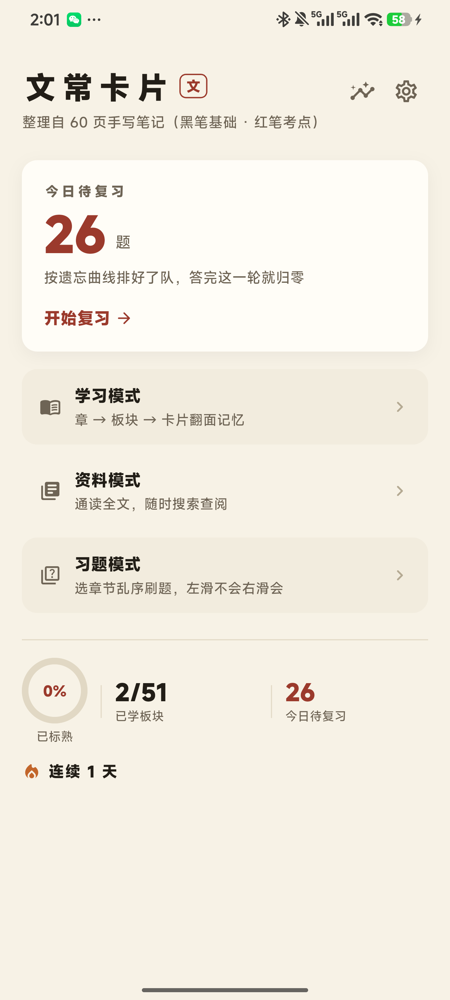
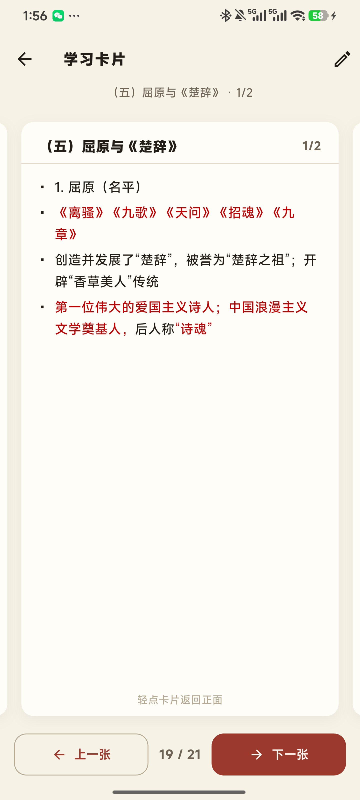
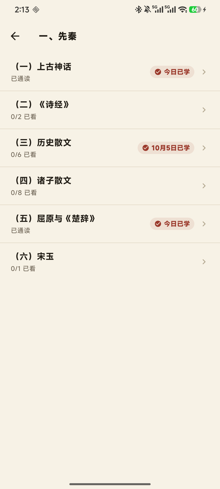
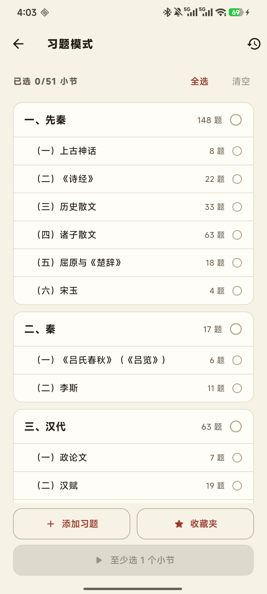
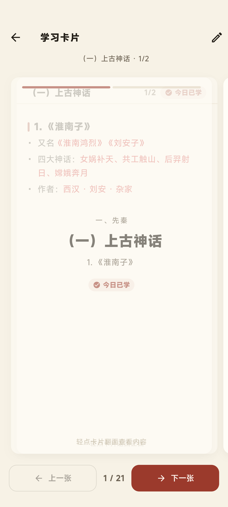

# 文常卡片 WenChang

把 60 页手写笔记《先秦文学常识提纲》变成**可学习、可复习、可查阅、可刷题**的卡片式记忆 App（Flutter · Android）。

> 黑笔为基础，红笔为考点——App 内所有红字与原稿**逐字一致**（字级还原）。



## 功能

| 模式 | 说明 |
|------|------|
| 📖 **学习** | 章 → 板块 → 卡片翻面记忆（400ms 渐变、自动翻开、进度记忆、断点续接） |
| 🔁 **复习** | 遗忘曲线排队、手势评级（左忘记/上生疏/右熟练）、累计 3 次正确标熟、随机开关 |
| 📚 **资料** | 776 条要点全文通读 + 搜索，红字考点原样呈现 |
| ✏️ **习题** | **1542 题**（含 63 道多空题）、章节/小节多选、错题历史、**自建题**、**⭐ 收藏夹**、✎ 纠错 |

**通用**：日期徽章（今日已学 / M月D日已学）、成就统计与连续打卡、6 色主题、字号 4 档、竖屏锁定、纠错覆盖全局生效。

| 学习卡（红字考点） | 日期徽章 | 习题选题页 |
|---|---|---|
|  |  |  |

## 下载

📦 **[Releases](https://github.com/Alorith-H/WenChang/releases)** 页面下载 `wenchang-release.apk` 直接安装（Android 5.0+）。

## 题库与数据

- 来源：《先秦文学常识提纲.docx》（11 章 / 51 板块 / 1343 要点）
- 命题规则：**只能用素材原文命题，禁止编造素材外知识**
- `assets/data/questions.json`：1542 题；`assets/data/source.json`：776 条字级红字要点
- 用户数据（进度/纠错/自建题/收藏）全部存 SharedPreferences，**升级更新不丢**

## 开发

```bash
flutter pub get
flutter analyze          # 0 issues
flutter test             # 单测全绿
flutter build apk --release
# 真机 e2e（翻面动画逐帧取证）
flutter test integration_test -d <device>
```

国内网络构建请设置 `FLUTTER_STORAGE_BASE_URL=https://storage.flutter-io.cn`。

**测试红线**：e2e 与手测**禁止 `pm clear com.alorith.wenchang`**（会清掉全部学习数据）。



*真机 500ms 中间帧：正面淡出、背面淡入（e2e integration_test 逐帧采样验证）*
